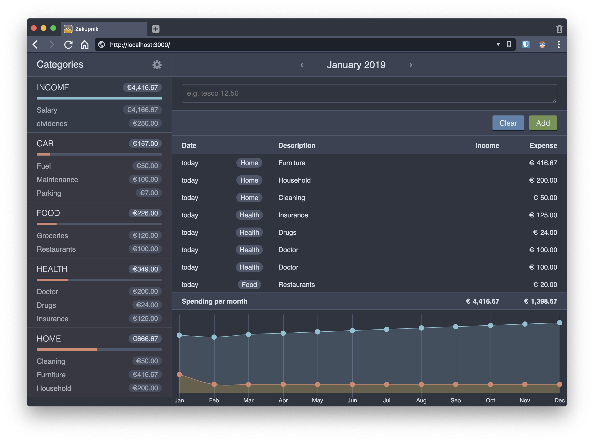

# ZAKUPNIK 3
Another version of a brilliant home-spendings-logger/manager.
Mobile friendly and simpler than ever.

## Screenshots



## Get started

### Docker
Requires docker to be installed and running.

Create `docker-compose.yml` file in a directory somewhere with the contents (or copy this file from the this repo):
```yml
version: '3.7'
services:
  zakupnik:
    container_name: zakupnik
    image: tborychowski/zakupnik
    ports:
      - "3000:3000"
    volumes:
      - type: bind
        source: ./database.db
        target: /zakupnik/database.db
```
Then run:
```sh
docker-compose up -d
```
Your app should be available on [localhost:3000](http://localhost:3000).
The database.db file should be created in the same directory, so you can back it up periodically.


### Local instance
Requires: `node` and `npm` to be installed locally.

Run the following commands:
```sh
git clone https://github.com/tborychowski/zakupnik3.git zakupnik
cd zakupnik
npm ci
npm run startprod
```


## Configuration
Create `.env` file:
- when running with docker - in the same directory as your `docker-compose.yml`
- when running locally - in the root dir of the repo

You can copy the attached `.env-example` file and just modify the values:
```env
SESSION_SECRET=abcdef
AUTH=true
LOGIN=admin
PASSWORD=admin
NODE_ENV=prod
```
- `SESSION_SECRET` - is used to encrypt the auth session and api requests
- `AUTH` - allows you to disable the authentication, and run the app without the need to login. This is not recommended when the app is deployed to a public location!
- `LOGIN` and `PASSWORD` - are your user credentials (when `AUTH` is `true`)
- `NODE_ENV` - is the environment type. `prod` or `production` should be set for production environments, otherwise: `dev` or `development`.


## Building docker image
Run
```sh
docker build -t tborychowski/zakupnik .
```
